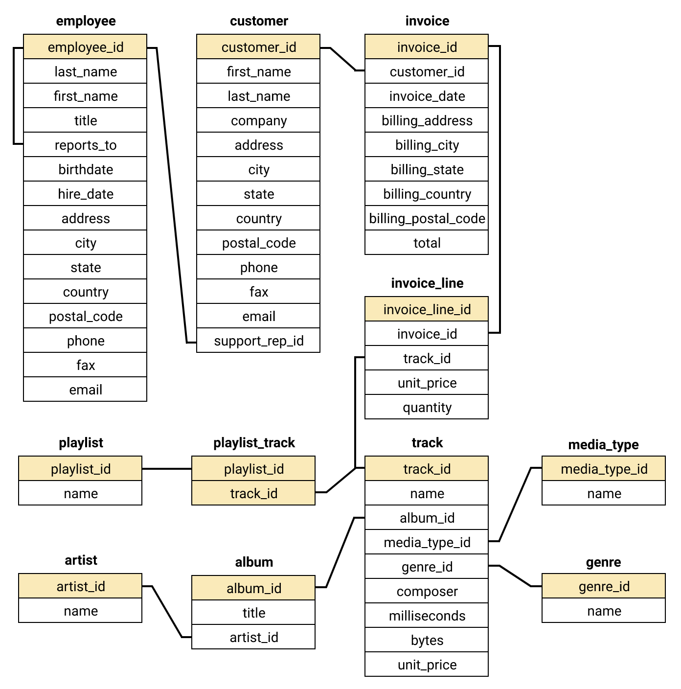

# Practicing SQL by Answering Real Life Business Problems

## Notebook Description

In this project we use SQL to explore the Chinook database, a collection of tables containing data referring to a mock digital media store. More specifically, we play the role of a consultant who has been asked to address some business questions related to the store's activity; retrieving the relevant data, we answer these questions by formulating a strategy which could maximize the revenues. 

The reader should keep in mind that the present project doesn't have any ambition to represent a sophisticated and profound business analysis. The problems presented, even though representitive of typical situations which occur among companies in real life, serve just as a pretext to query the database with a purpose; in fact, the primary goal is simply to enhance my SQL coding skills and getting used to write increasingly more complex queries.

## About the Data

For this project we use the Chinook database, a sample database which is available on [this GitHub repo](https://github.com/lerocha/chinook-database). It contains information about a fictional digital media store across eleven tables; a schema diagram of the database and the content of each table is available in the cover image above. 

Media related data (such as songs', artists' and albums' names) was created using real data from an iTunes Library; customer and employee information was manually created using fictitious names, addresses that can be located on Google maps, and other well formatted data (phone, fax, email, etc.); sales information was auto generated using random data for a four year period.

We will use SQLite to connect to and query the database; nevertheless, different versions of this same database that support many other SQL based servers (like MySQL and PostgreSQL) are available. For more info about how to access these versions and for detailed installation related instructions, the reader should refer to the GitHub repo we linked above.      

## Project's Genesis

I started and completed this project in the early stages of my data science journey as I was going through [Dataquest's](https://www.dataquest.io/) *Data Scientist* learning path. In particular, inspiration for some of the questions that appear in the notebook was taken directly from the related lesson in the *Intermediate SQL for Data Analysis* section of the path.